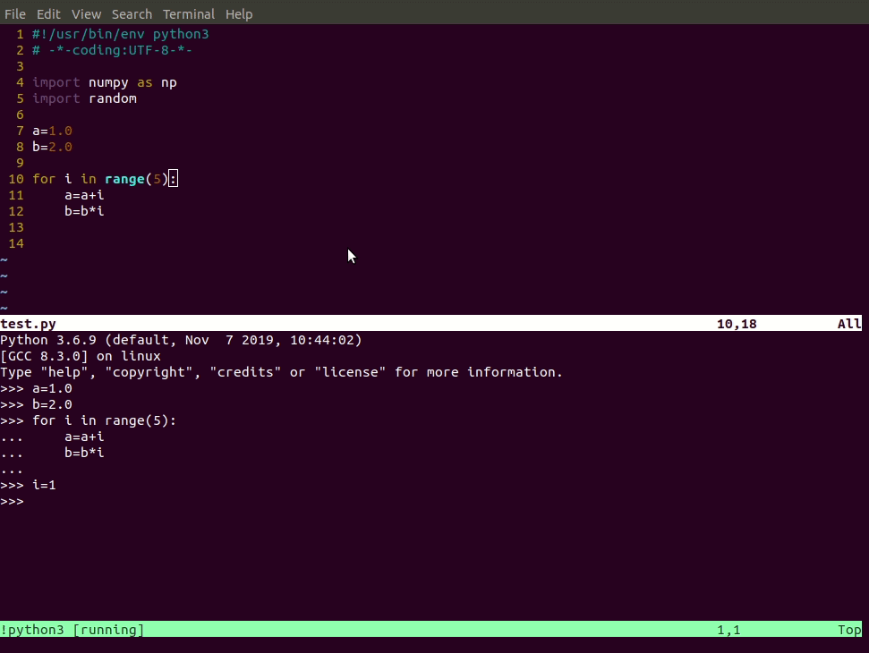

# vim-interact-terminal
Interact wtih the terminal in vim 8.1 especially for Python programming. Theoretically, it can also be used for bash and other languages. The main fecture is sending the commands to the console and execute without considering the indent problem !

Advantages compared with other similar plugins
- installation and configuration are so easy without any effort. In fact there is no configuration at all !
- support multiple languages, including `Python`,`bash`
- support virtual environment of `Python` naturally, which can be verified by following steps
	- activate one `venv`,
	- open a `*.py` using `vim`
	- type`:terminal` to open a built-in terminal
	- type `pip show numpy`(or other packages), which can list the location of package. Using the location to tell whether it's in the virtual environment or not

# install
Copy the content in `vimrc` to the vim config file, eg`~/.vimrc`.

# usage
The short cut is `<leader>s`.
- in `normal mode`: typing `<leader>s` will send the current line to the console and execute
- in `visual mode`: typing `<leader>s` will send the selected lines to the console and execute

example

send commands with indent

bash command

# issue
- ==Solved==. There will be two indents in `ipython` console.This is because `ipython` console will add one indent automatically, which is quite different in `python` console. This issue will be solved in the future. 
`ipython` console

`python` console

