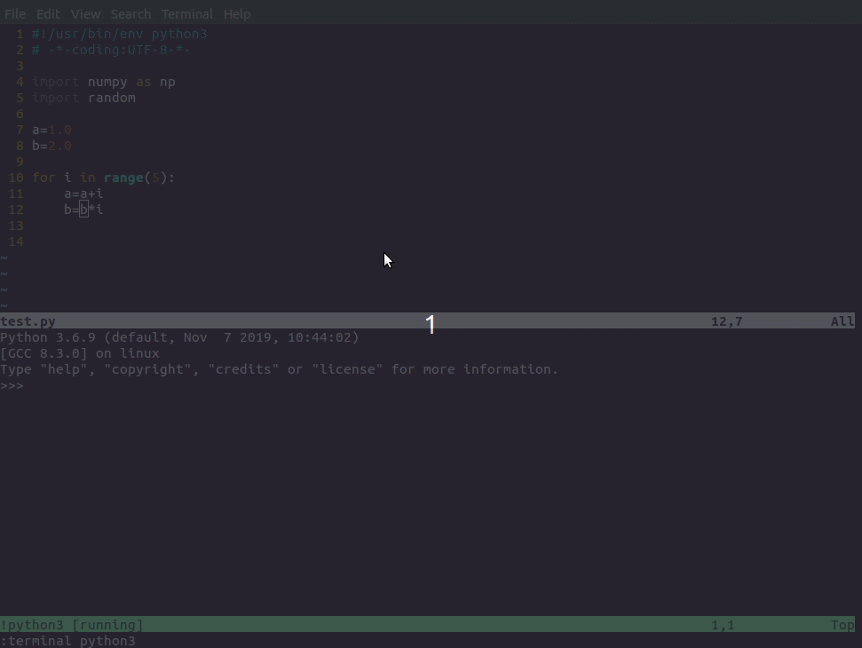
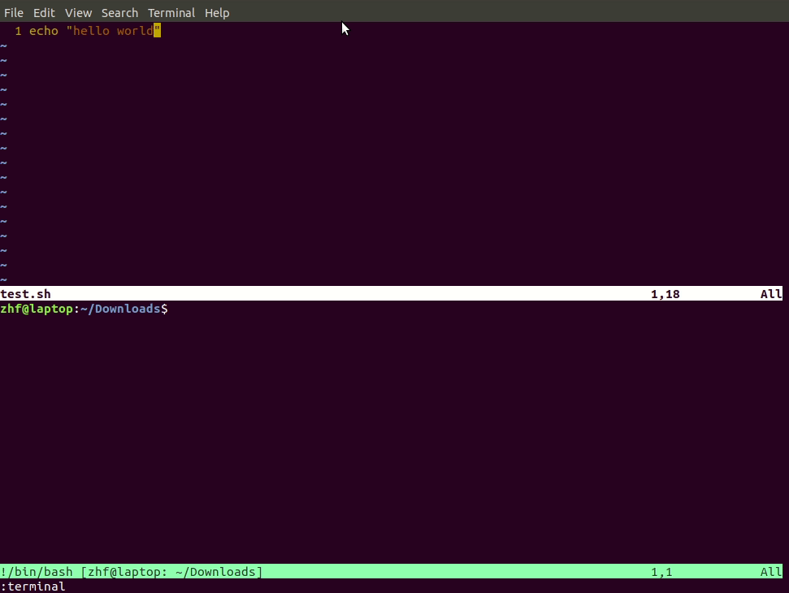
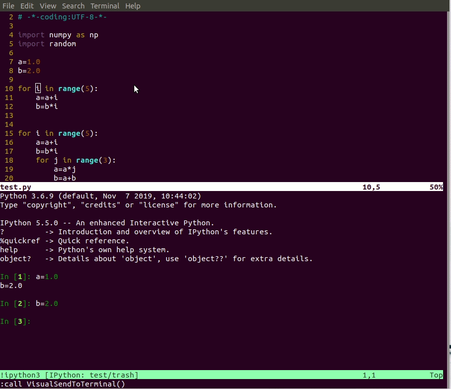
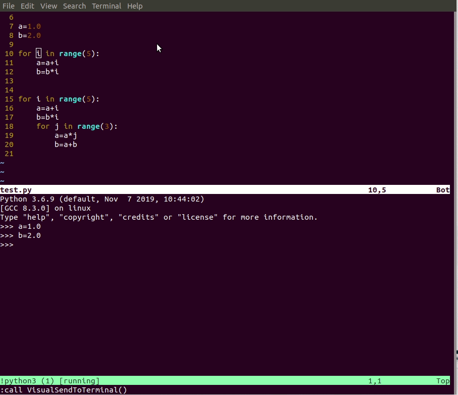

# vim-interact-terminal(REPL)
Interact wtih the terminal, or REPL(Read-Eval-Print Loop), in vim 8.1 especially for Python programming. Theoretically, it can also be used for bash and other languages. The main feature is sending the commands to the console and execute without considering the indent problem !

Advantages compared with other similar plugins
- installation and configuration are so easy without any effort.
- support multiple languages, including `Python`,`bash`
- support virtual environment of `Python` naturally, which can be verified by following steps
	- activate one `venv`,
	- open a `*.py` using `vim`
	- type`:terminal` to open a built-in terminal
	- type `pip show numpy`(or other packages), which can list the location of package. Using the location to tell whether it's in the virtual environment or not


# install
Copy the content in `vimrc` to the vim config file, eg`~/.vimrc`.

After the installation, there are two ways to open the `ipython` console:
- open the console with `--no-autoindent`, for example
```python
:terminal ipython3 --no-autoindent
```
Otherwise this plugin can't work properly!
- open the console with built-in command
```python
:Ip3
```
which is controlled by the following config
```python
command Ip3 terminal ipython3 --no-autoindent
command P3 terminal python3
```
So, you can change the alias by yourself

# usage
The short cut is `<leader>s`.
- in `normal mode`: typing `<leader>s` will send the current line to the console and execute
- in `visual mode`: typing `<leader>s` will send the selected lines to the console and execute
- in `visual mode`: typing `<leader>j` will just send the selected content, which can be a few words in one line or several lines, to the console without executing

example

send commands with indent

bash command


# issue
- Fix the blank lines issue when sending code blocks into `Python` console. Detail can be refered from [Copy-paste into Python interactive interpreter and indentation](https://stackoverflow.com/questions/7712389/copy-paste-into-python-interactive-interpreter-and-indentation),  [Python interactive interpreter has problems with blank lines when I paste in a script [duplicate]](https://stackoverflow.com/questions/37891771/python-interactive-interpreter-has-problems-with-blank-lines-when-i-paste-in-a-s),  [Blank line rule at interactive prompt](https://stackoverflow.com/questions/8391633/blank-line-rule-at-interactive-prompt) and [How to automatically insert spaces to make empty lines in Python files indent?](https://stackoverflow.com/questions/49507297/how-to-automatically-insert-spaces-to-make-empty-lines-in-python-files-indent)
- Fix the indent issue in `ipython` : can't send long code blocks to `ipython` console. The reason is explained in [jpalardy/vim-slime](https://github.com/jpalardy/vim-slime/blob/master/autoload/slime.vim). The magic function in `ipython` can't reach the target, which is explained in [Turn off IPython autoindent on submit #71](https://github.com/kassio/neoterm/issues/71). The way to solve the issue is : disable the autoindent in `ipython`
- Add new feature : just sending the selected content to the console without executing

`ipython` console

`python` console


