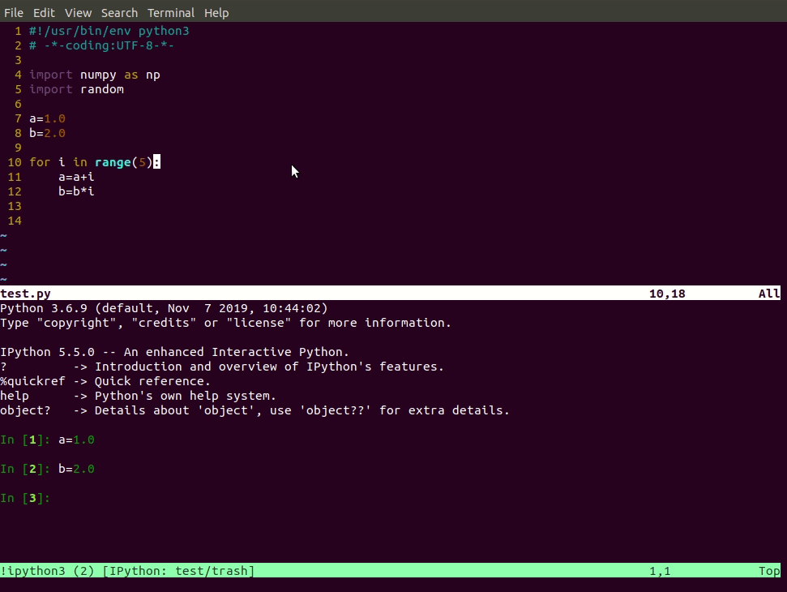

# vim-interact-terminal
Interact wtih the terminal in vim 8.1 especially for Python programming. Theoretically, it can also be used for bash and other languages although. The main fecture is sending the commands to the console and execute without considering the indent problem!

# install
Copy the content in `vimrc` to the vim config file, eg`~/.vimrc`.

# usage
The short cut is `<leader>s`.
- in `normal mode`: typing `<leader>s` will send the current line to the console and execute
- in `visual mode`: typing `<leader>s` will send the selected lines to the console and execute

example

send commands with indent

bash command

# issue
There will be two indents in `ipython` console.

This is because `ipython` console will add one indent automatically. This issue will be solved in the future.